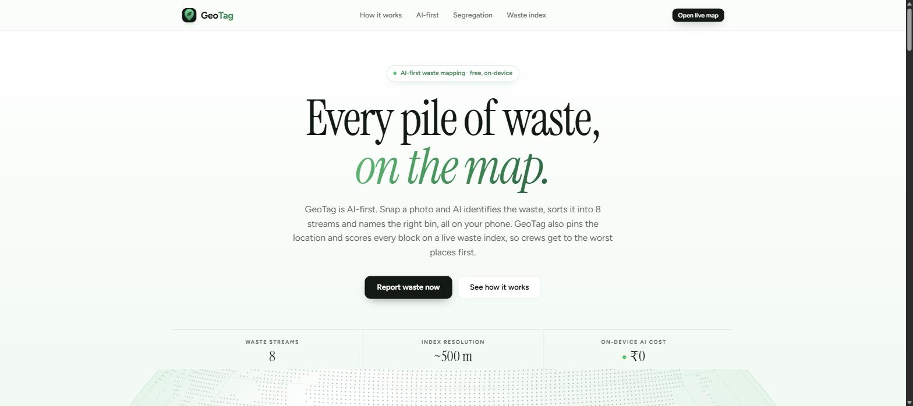
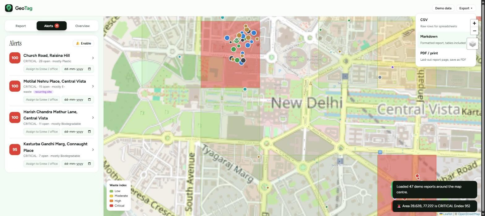
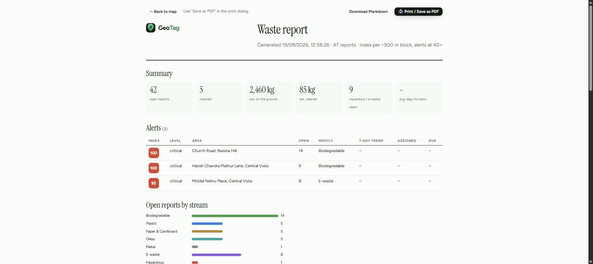

<div align="center">


# GeoTag

**Every pile of waste, on the map.**

AI-first waste mapping for citizens, cleanup crews and city officers.
Snap a photo, on-device AI sorts it into the right bin, the map scores every block, and the worst places get a ticket.

[](https://geo-tag-pi.vercel.app)
[](src/lib/geotag.test.js)
[](#license)
[](package.json)
[](package.json)
[](public/manifest.webmanifest)
[](#how-the-ai-works)
[](https://devfolio.co/projects/geotag-1)

<a href="https://geo-tag-pi.vercel.app"></a>

</div>

---

## Contents

- [Why](#why)
- [What it does](#what-it-does)
- [How it works](#how-it-works)
- [How the AI works](#how-the-ai-works)
- [Waste index](#waste-index)
- [Quick start](#quick-start)
- [Shared backend (optional)](#shared-backend-optional)
- [Roles](#roles)
- [Exports and reports](#exports-and-reports)
- [Project layout](#project-layout)
- [Development](#development)
- [Roadmap](#roadmap)
- [Origins](#origins)
- [License](#license)

## Why

Cities collect waste on fixed routes and find out about dumps when someone complains. GeoTag flips that. Anyone with a phone can tag a pile in ten seconds. AI does the sorting, the map scores every ~500 m block on a live **waste index**, and crews are sent where the index is highest, not where they went yesterday.

Everything runs in the browser. No API keys, no per-photo cost, and photos never leave the device. Add a Supabase project when a team needs one shared map.

## What it does

<div align="center">
<a href="https://geo-tag-pi.vercel.app/app"></a>
<br><sub>Live map: alerts with tickets, a recurring dumping site flagged, and the export menu.</sub>
</div>

<br>

| For citizens | For crews | For officers and NGOs |
|---|---|---|
| Photo or live camera scan | Alerts sorted by index | Tickets with assignee and due date |
| AI names the stream and the bin | Before/after cleanup verified by AI | Overdue tickets flagged |
| GPS, photo EXIF, or drop a pin | Works offline, syncs later | Ward roll-ups from a GeoJSON import |
| Duplicate piles merged into one | Recurring dumping sites flagged | CSV, Markdown and PDF reports |
| Which-bin sorter on the landing page | Installable PWA | Impact metrics: kg cleared, days to clean |

**Eight waste streams**

| Stream | Bin | Stream | Bin |
|---|---|---|---|
| Biodegradable | Green bin | Metal | Blue bin (dry) |
| Plastic | Blue bin (dry) | E-waste | E-waste drop-off |
| Paper & Cardboard | Blue bin (dry) | Hazardous | Red bin / special collection |
| Glass | Glass bank | Non-biodegradable | Black bin (reject) |

Mixed piles are flagged so they can be separated before disposal.

## How it works

```
 photo / camera ──► MobileCLIP zero-shot ─┐
                    COCO-SSD boxes        ├─► decide category ──► report {lat, lng, stream, size}
 typed note ──────► keyword rules         │                              │
 your past labels ► k-NN memory ──────────┘                              ▼
                                                              ~500 m grid cell
 GPS / EXIF / pin ──────────────────────────────────────────►  index = Σ size × harm × recency
                                                                         │
                             ┌───────────────────────────────────────────┤
                             ▼                          ▼                ▼
                      alert at 40+              ticket (assign, due)   ward roll-up
                      trend vs 7 days ago       closes when index      CSV / Markdown / PDF
                      recurring-site flag       drops below 40         impact metrics
```

1. **Tag.** Take a photo or use the live scanner. Location comes from GPS, from the photo, or from a pin you drop.
2. **Segregate.** Three on-device models and your own past labels agree on one of 8 streams. You can always override.
3. **Map.** Reports fall into ~500 m cells. Each cell is scored by volume, harm and recency.
4. **Act.** Cells over the threshold become alerts and tickets. Crews close them with an "after" photo that AI verifies.

## How the AI works

| Model | Job | Size |
|---|---|---|
| MobileCLIP-S1 (Transformers.js) | Zero-shot scoring of the whole scene against the 8 streams | 43 MB fp16, cached after first load |
| COCO-SSD (TensorFlow.js) | Draws a box around each detected item, powers the live scan | ~6 MB |
| MobileNet (TensorFlow.js) | Scene label and an embedding for the k-NN memory | ~4 MB |
| k-NN memory | Learns from every photo you label, stored locally | 0 |

The signals are combined by one small decision function in `src/lib/geotag.js`: your own past labels win, then CLIP, then detected objects, then the scene, then the typed note. The same CLIP model checks "after" photos when a spot is marked cleaned.

## Waste index

```
index(cell) = min(100, 5 × Σ  volume × harm × 0.5^(age / 7 days))   over open reports in the cell
```

| Factor | Values |
|---|---|
| volume | small 1 · medium 3 · large 8 |
| harm | hazardous 3 · e-waste 2 · plastic, non-bio 1.5 · glass 1.2 · paper, metal 1 · biodegradable 0.8 |
| recency | weight halves every 7 days |

Levels: low < 15 ≤ moderate < 40 ≤ **high** < 70 ≤ **critical**. High and critical raise alerts. Improvements never trigger alerts.

## Quick start

```bash
git clone https://github.com/abhinavakhil/GeoTag.git
cd GeoTag
npm install
npm run dev        # http://localhost:5173  (landing at /, app at /app, report at /report)
```

Open the app and tap **Demo data** to see sample reports around the map centre, or tag your first pile. Data lives in this browser until you connect a backend.

```bash
npm test           # core logic tests (segregation, index, EXIF, k-NN, duplicates, wards, tickets, reports)
npm run build      # static site in dist/ (serve with SPA fallback so /app works)
npm run embed      # rebuild src/data/ai-prompts.json after editing AI_PROMPTS
```

## Shared backend (optional)

One map for a whole ward office, with sign-in, roles and live updates on every device. GeoTag uses [Supabase](https://supabase.com) (Postgres + PostGIS, row-level security, realtime). Without keys the app runs fully client-side.

1. Create a Supabase project.
2. Open **SQL editor**, paste [`supabase/schema.sql`](supabase/schema.sql), run it. This creates `profiles`, `reports`, `tickets`, `wards`, the role helpers, RLS policies and realtime.
3. Copy the URL and anon key from **Project Settings → API** into `.env` (see [`.env.example`](.env.example)):
   ```
   VITE_SUPABASE_URL=https://xxxx.supabase.co
   VITE_SUPABASE_ANON_KEY=eyJ...
   ```
4. Restart the dev server. A **Sign in** button appears. Sign-in is a passwordless email link.
5. Make yourself admin once:
   ```sql
   update profiles set role = 'admin' where email = 'you@example.com';
   ```

What sync does: reports are saved locally first and pushed after. Anything filed offline is queued and pushed when the network is back. Other devices receive changes live. Tickets and ward boundaries are shared too.

## Roles

| Role | Can |
|---|---|
| anonymous | View the map |
| citizen | File reports, edit and delete their own |
| crew | Mark any report cleaned, with AI verification |
| officer | Assign tickets, set due dates, delete reports, export |
| admin | Import ward boundaries, change roles |

Roles are enforced by Postgres row-level security, not just in the UI. In local-only mode everything is allowed.

## Exports and reports

<div align="center">

<br><sub>The report page at <code>/report</code>: summary, alerts with tickets and trends, streams, wards, every report.</sub>
</div>

<br>

| Format | Use |
|---|---|
| **CSV** | Raw rows for spreadsheets and GIS. Includes ward, verified, sightings. |
| **Markdown** | Same report as tables, for wikis, tickets and email. |
| **PDF** | Print-styled page. Browser print dialog → Save as PDF. No PDF library. |

## Project layout

```
src/
  pages/Landing.jsx          landing page: globe, which-bin sorter, index calculator
  pages/MapApp.jsx           live map, tabbed sidebar (Report / Alerts / Overview), tickets, cleanup verification, sign-in
  pages/Report.jsx           print-ready report page and Markdown download
  components/ReportForm.jsx  photo upload, live camera scan, category, size, location
  components/WasteMap.jsx    Leaflet map: index cells, pins, ward outlines, recurring flags
  components/Globe.jsx       dotted globe with an illustrative feed
  lib/geotag.js              segregation rules, waste index, EXIF GPS, zero-shot scoring, k-NN   (pure, tested)
  lib/ops.js                 duplicates, wards, trends, tickets, impact, report builder           (pure, tested)
  lib/vision.js              the three browser models, lazy-loaded
  lib/sync.js                optional Supabase sync: auth, pull/push, realtime, offline queue
  lib/storage.js             localStorage helpers
  data/ai-prompts.json       pre-embedded text prompts for zero-shot scoring
supabase/schema.sql          tables, roles, RLS policies, realtime
public/sw.js, manifest.webmanifest   PWA: offline app shell and install metadata
tools/embed-prompts.mjs      regenerates ai-prompts.json
```

## Development

- **Stack**: React 19, Vite 8, React Router, Leaflet, TensorFlow.js, Transformers.js, Supabase JS. No CSS framework.
- **Tests**: `npm test` runs `src/lib/geotag.test.js` with Node's `assert`. All core logic is pure functions.
- **Deploy**: any static host with SPA fallback. Set the two `VITE_SUPABASE_*` variables in the host's environment to enable sync. The live demo is on Vercel.
- **Privacy**: photos are analysed on the device. Only a small JPEG is stored, and only sent to your own Supabase project if you enable sync.

## Roadmap

- [x] On-device segregation, live camera scan, waste index, alerts
- [x] Tickets, SLA, AI cleanup verification, duplicate merging
- [x] Ward boundaries, trends, recurring sites, impact metrics
- [x] CSV / Markdown / PDF reports, PWA offline
- [x] Supabase sync with roles and realtime
- [ ] WhatsApp / SMS reporting bot
- [ ] Hindi and regional-language UI, voice notes
- [ ] Public ward scorecard and open-data API
- [ ] Forecasting recurring sites from index history

## Origins

GeoTag started as team **sudoNinjas**' project at **hackpcbt (February 2020)**, where it won a category prize. See the [Devfolio submission](https://devfolio.co/projects/geotag-1). The 2020 version ran on Node.js, AngularJS, MongoDB, Android, TensorFlow and Azure Custom Vision. This rebuild keeps the idea and moves the AI into the browser so it costs nothing to run.

Team: Aman Kumar Soni, Shubham Patel, Abhinav Akhil, Abhishek Kumar, Kommi Narasimha Naidu.

## License

MIT. Map data © [OpenStreetMap](https://www.openstreetmap.org/copyright) contributors.
